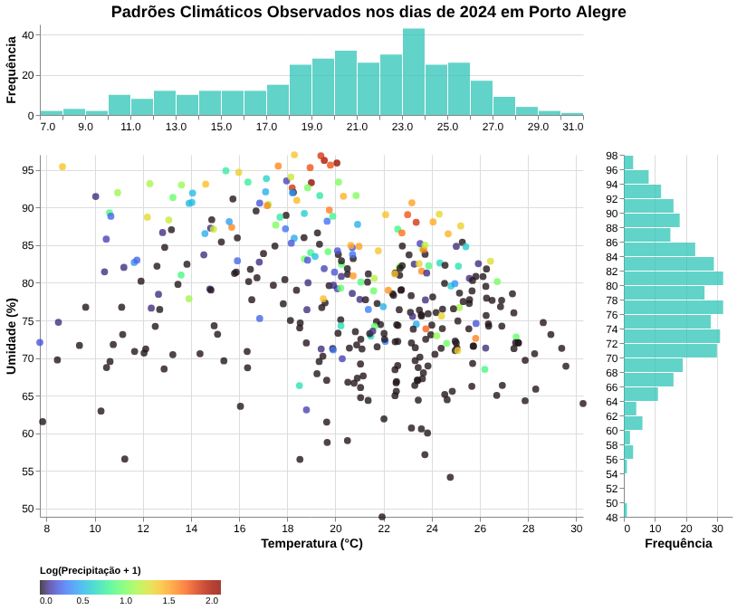

# Relatório

> [!CAUTION]
>
> - Você <ins>**não pode utilizar ferramentas de IA para escrever este relatório**</ins>.

## Identificação

- **Nome**: Pedro Schuck de Azevedo
- **Cartão UFRGS:** 587553

## Dados utilizados

> [!IMPORTANT]
>
> - Os dados utilizados devem ser informados como **links** para as fontes originais.
> - Se houver mais de um conjunto de dados, liste todos separadamente.
> - Para cada conjunto de dados, inclua também uma **descrição curta** explicando os dados.

1. **Dataset Instituto Nacional de Meteorologia (INMET)**: https://portal.inmet.gov.br/dadoshistoricos
    * **Descrição curta**: Dados meteorológicos com múltiplas variávies (precipitação, umidade, temperatura e etc) de distintos períodos de tempo e locais do Brasil. Especificamente para esta visualização, utilizou-se dados de Porto Alegre do ano de 2024.

## Código-fonte da visualização

> [!IMPORTANT]
>
> - Indique abaixo onde está, dentro deste repositório, o código-fonte usado para gerar a visualização.

- **Arquivo principal**: visualization-project.ipynb
- **Arquivos complementares (se houver)**: dados_climaticos_jardim_botanico.CSV
  - Dados climáticos referentes ao bairro Jardim Botânico usados para gerar a visualização.

## Imagem da visualização gerada

> [!IMPORTANT]
>
> - Insira aqui uma imagem da visualização criada por você. Troque `imagem-da-visualizacao.png` pelo caminho correto do arquivo no repositório. 
> - Se você criou alguma visualização interativa, então descreva aqui como acessá-la. Por exemplo, se for uma página HTML, coloque o link, ou se for uma visualização 3D, descreva como compilar e executar o código. 

Para interagir com a visualização (checar os atributos de cada ponto do scatter plot) basta rodar as células do notebook em qualquer ambiente que possua as bibliotecas pandas e altair de python, desde que os dados do .CSV estejam na mesma pasta que este.

## Descrição da visualização

### Legenda (*caption*)

> [!IMPORTANT]
>
> - Escreva um texto curto explicando como interpretar a visualização. Descreva os elementos visuais, eixos, cores, símbolos ou interações relevantes.
> - Este texto seria a legenda (*caption*) que acompanharia a figura em uma publicação, por exemplo.

Scatter plot da temperatura (°C) pela umidade (%) para todos os dias do ano de 2024 no bairro Jardim Botânico de Porto Alegre. Cada ponto representa um dia no scatter plot com a cor referindo-se a quantidade de precipitação (mm) nele, com dois histogramas indicando a distribuição de frequência de pontos para cada um dos eixos do gráfico.

### Conclusão demonstrada pela visualização

> [!IMPORTANT]
>
> - Escreva uma conclusão curta sobre os dados com base na visualização.
> - Explique qual insight, padrão ou tendência pode ser observado.

- Percebe-se que existe uma leve correlação negativa entre temperatura e umidade, ou seja, dias mais quentes tendem a ser menos úmidos, fator indicado pela inexistência de dias com altas temperaturas e umidade simultaneamente, que estariam localizadas no canto superior direito do scatter plot;
- Fora isso, a precipitação parece ser a causa de alguns dos dias mais úmidos, representado pelos pontos mais laranjas e amarelos estarem predominantemente na parte superior do gráfico;
- Focando na distribuição dos histogramas, nota-se que a grande maioria dos dias encontra-se nos intervalos de 18 a 26°C de temperatura e 70 a 86% de umidade, apontando para uma predominância anual de temperaturas amenas e umidade relativamente alta.
